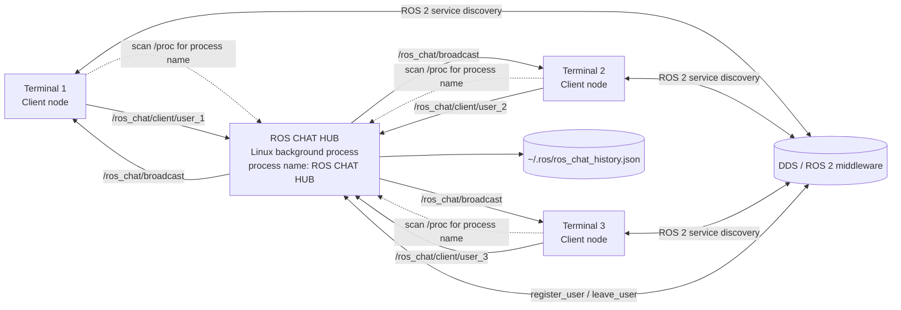

# ROS Chat Architecture Decision

## Decision

Use ROS 2 Jazzy topics for chat, system notifications, heartbeats, and telemetry. Each client has one outbound topic. The hub has one shared broadcast topic. Use ROS 2 services only for registration and departure control requests. Run one `ROS CHAT HUB` Linux background process per ROS 2 domain.

## Diagram

## Message routing

1. A client sends a record to its own `/ros_chat/client/<user-id>` topic.
2. The hub identifies the sender from the topic subscription and validates the record.
3. The hub adds the assigned sender colour and timestamp.
4. The hub stores chat messages.
5. The hub publishes one record on `/ros_chat/broadcast`.
6. Every client receives the same broadcast record, including the sender.
7. Each receiving client renders the sender ID in the colour assigned by the hub.
8. The sending client renders its local copy in white.

ROS 2 uses DDS to deliver each client outbound topic to the hub and the shared broadcast topic to every client. The sender does not locally echo its message. It waits for the hub broadcast, so all terminals use the same delivered record. Chat, system, and telemetry records use the same broadcast path.

## Process lifecycle

`scripts/start_node` is the internal hub startup script. The client starts it with `subprocess.Popen(..., start_new_session=True)`. It runs `ros2 run ros_chat hub_node`, so the hub remains a separate long-running Linux process after the client startup call returns. The hub sets its Linux process name to `ROS CHAT HUB` and writes its current PID to `/tmp/ros_chat_hub.pid` for inspection.

The PID is not a connection address. A client searches process names, then waits for the ROS 2 `/ros_chat/register_user` service. Ctrl-C calls `/ros_chat/leave_user`. The hub removes the user and broadcasts a system event. If the user set is empty, the hub exits. Heartbeat expiry handles force-killed clients.
